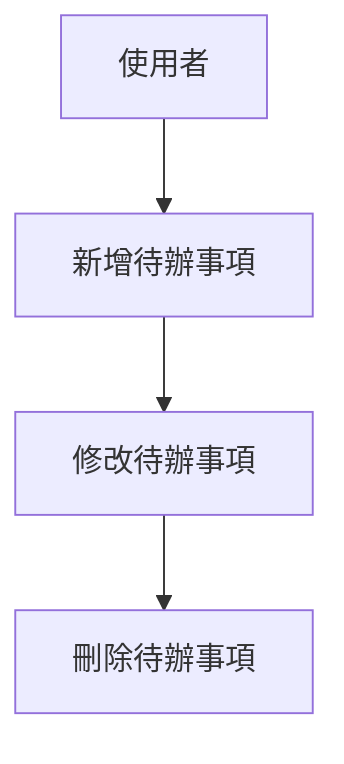

# 繪製 Mermaid 流程圖

## 使用時機

- 使用者描述一段流程，並希望視覺化。
- 使用者要求輸出 Mermaid 語法。

## 工作步驟

1. 理解使用者描述的流程與順序。
2. 以 `graph TD` 輸出 Mermaid 流程圖。

## 輸出格式

```mermaid
graph TD
    A[使用者] --> B[新增待辦事項]
    B --> C[修改待辦事項]
    C --> D[刪除待辦事項]
```

## 參考範例

- 常見流程圖範例請見 [examples.md](examples.md)。
