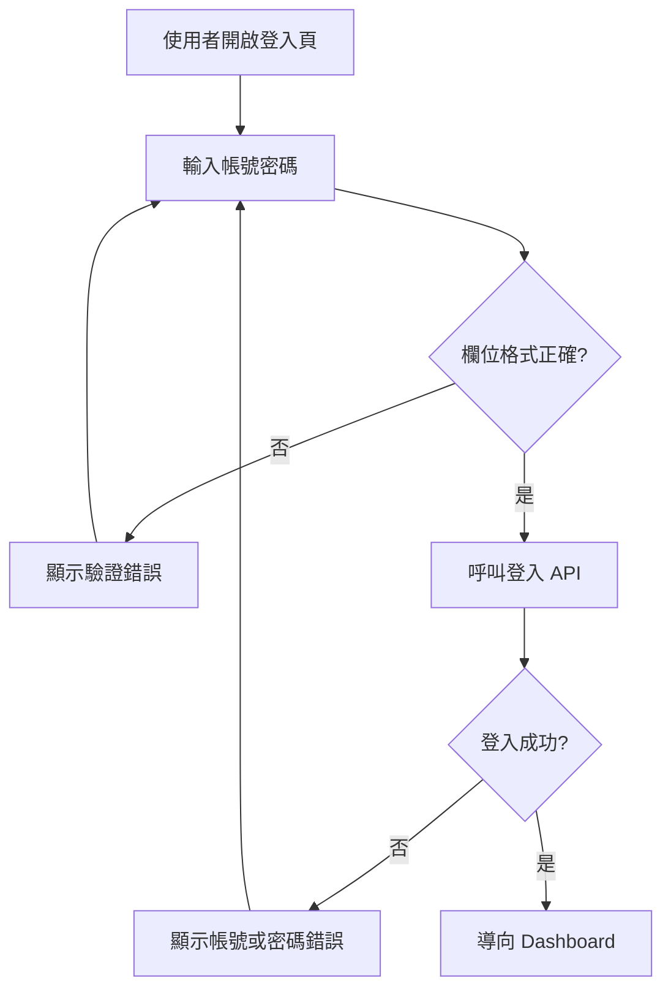
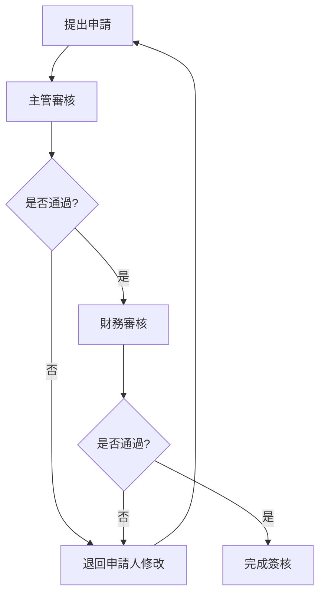
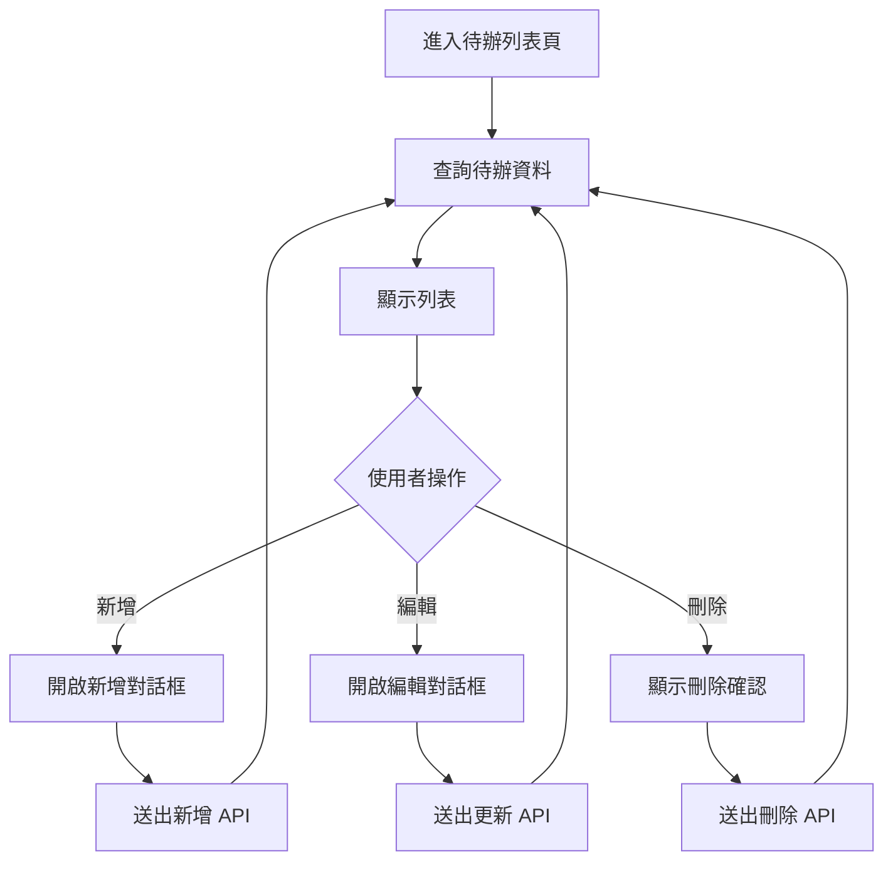

# Mermaid 流程圖範例

## 範例 1：登入流程

```mermaid
graph TD
    A[使用者開啟登入頁] --> B[輸入帳號密碼]
    B --> C{欄位格式正確?}
    C -- 否 --> D[顯示驗證錯誤]
    D --> B
    C -- 是 --> E[呼叫登入 API]
    E --> F{登入成功?}
    F -- 否 --> G[顯示帳號或密碼錯誤]
    G --> B
    F -- 是 --> H[導向 Dashboard]
```

## 範例 2：簽核流程

```mermaid
graph TD
    A[提出申請] --> B[主管審核]
    B --> C{是否通過?}
    C -- 否 --> D[退回申請人修改]
    D --> A
    C -- 是 --> E[財務審核]
    E --> F{是否通過?}
    F -- 否 --> D
    F -- 是 --> G[完成簽核]
```

## 範例 3：待辦 CRUD 流程

```mermaid
graph TD
    A[進入待辦列表頁] --> B[查詢待辦資料]
    B --> C[顯示列表]
    C --> D{使用者操作}
    D -- 新增 --> E[開啟新增對話框]
    E --> F[送出新增 API]
    F --> B
    D -- 編輯 --> G[開啟編輯對話框]
    G --> H[送出更新 API]
    H --> B
    D -- 刪除 --> I[顯示刪除確認]
    I --> J[送出刪除 API]
    J --> B
```
